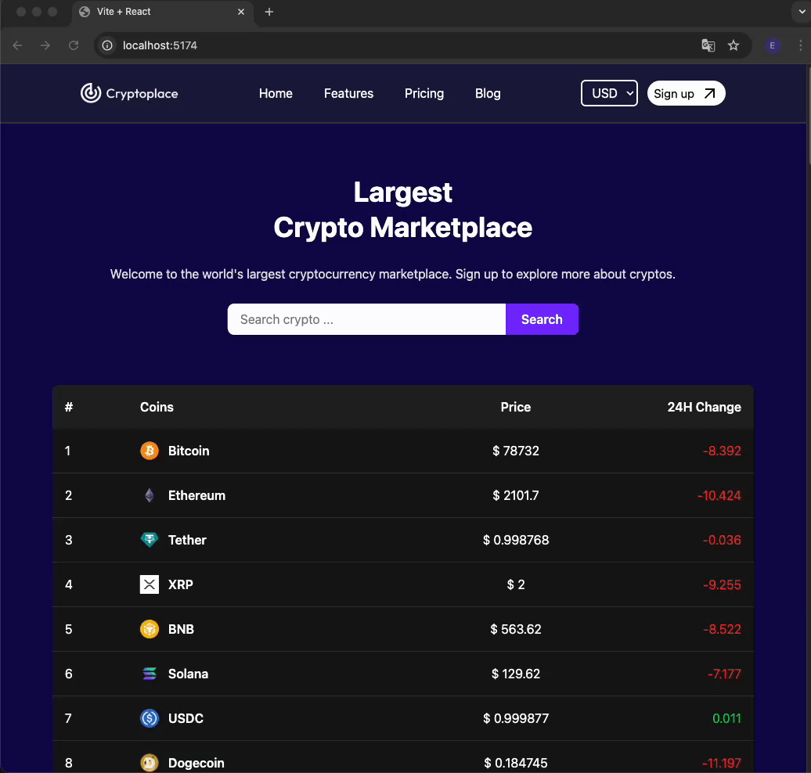

<h1>CryptoPlace Project 💰🚀</h1>

<h2>1️⃣ Project Overview 📌</h2>

<h3>CryptoPlace is a modern web application where users can track the cryptocurrency market with real-time data, charts, and analytics. 📊✨
</h3>

<h3>Users can check the prices of various cryptocurrencies, analyze trends, and make informed decisions. 🔍💹</h3>

<h2>2️⃣ Technologies Used 🛠️</h2>

<h3>React ⚛️ – Provides a fast and dynamic user interface.</h3>

<h3>Vite ⚡ – Ensures a fast and optimized development experience.</h3>

<h3>Tailwind CSS 🎨 – Delivers a sleek and modern design.</h3>

<h3>Axios 🔄 – Fetches real-time cryptocurrency data via API requests.</h3>

<h3>React Router 🚏 – Handles smooth navigation between pages.</h3>

<h3>React Google Charts 📊 – Visualizes cryptocurrency prices with interactive charts.</h3>

<h3>React Icons 🎭 – Enhances the UI with beautiful icons.</h3>

<h3>ESLint ✅ – Improves code quality and helps catch potential issues.</h3>

<h2>3️⃣ Key Features ⭐</h2>

<h3>✅ Live Cryptocurrency Data 📈 – Users can view up-to-date market prices.</h3>

<h3>✅ Modern & Responsive Design 🎨 – Built with Tailwind CSS for a seamless user experience.
</h3>

<h3>✅ Charts & Analytics 📊 – Integrated with Google Charts for better data visualization.</h3>

<h3>✅ Fast & Optimized Performance ⚡ – Powered by Vite for a super-fast development experience.</h3>

